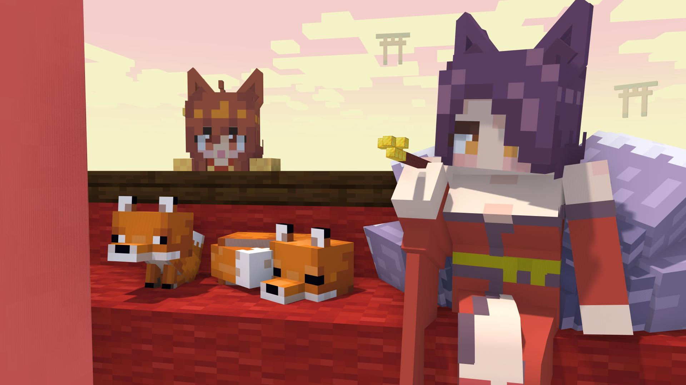
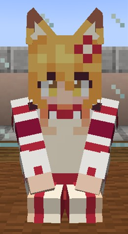
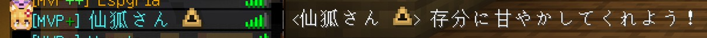
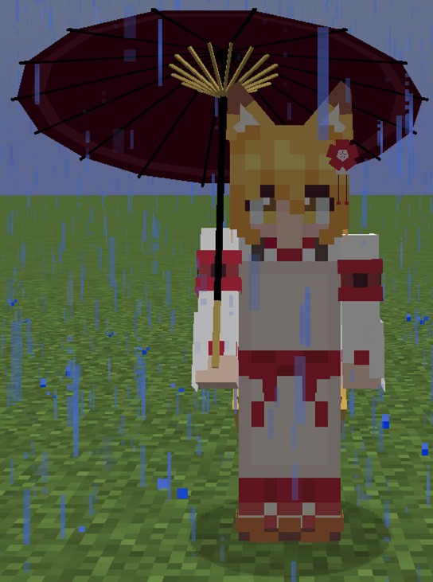

Language: 　**English**　|　[日本語](./README_jp.md)

# Information

This is the download page for **Sora**.

Click [here](https://github.com/Gakuto1112/SenkoSan/tree/Senko) for the download page for **Senko**.

Click [here](https://github.com/Gakuto1112/SenkoSan/tree/Shiro) for the download page for **Shiro**.

Click [here](https://github.com/Gakuto1112/SenkoSan/tree/Suzu) for the download page for **Suzu**.

# Sora (夜空)
This is "Sora (夜空)", the avatar for [Figura](https://modrinth.com/mod/figura), the skin mod for [Minecraft](https://www.minecraft.net/en-us), which imitates the character who appears in the TV anime "Sewayaki Kitsune no Senko-san" series and the original manga series.

Target Figura versions: [0.1.1](https://modrinth.com/mod/figura/version/0.1.1+1.20.1-0f8b7a9)~

## Features
- Has ears and tail models.
  - Her tail sways with the player's movements.

    

  - You can jerk the ears with **X key** and wag the tail with **Z key**.

    

    

- Her ears droop and har facial expression changes depending on the player's health and satiety.

  

- Sometimes she blinks.

- Can sit down with [the action wheel](#the-action-wheel).

  

- Can change the facial expressions with the cursor keys (↑→↓←).

  

- Changes vanilla swords to [Naginatas](https://en.wikipedia.org/wiki/Naginata) (from episode 77 of the manga).
  - Holds the naginata when held in the main hand (not in the off hand).
  - Takes a defensive stance with naginata when using a shield while holding a naginata.

  

- Takes a special sleeping pose at bedtime.

  

- Can change your display name to her name.
  - **Other players also need to install Figura and give enough permissions** to see your display name.

  

- Takes an umbrella if it's raining.
  - Won't get wet when taking it.
  - Won't take it when holding an item in off hand or playing an animation (of course, she gets wet in the case).
  - The umbrella open/close sound can disable in [the settings](#action-4-7-toggle-umbrella-openclose-sound).

  

- Appears foxfires (small fireballs) around her when she has the night vision effect.
  - The number of foxfires is different depends on the character.
  - They are extinguished when getting wet.
  - Using a shader pack make them look more like foxfires thanks to its bloom effects.

  

## The action wheel