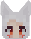
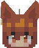
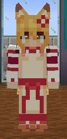
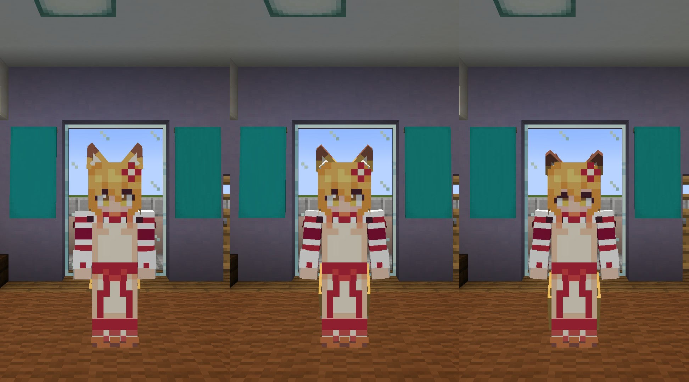
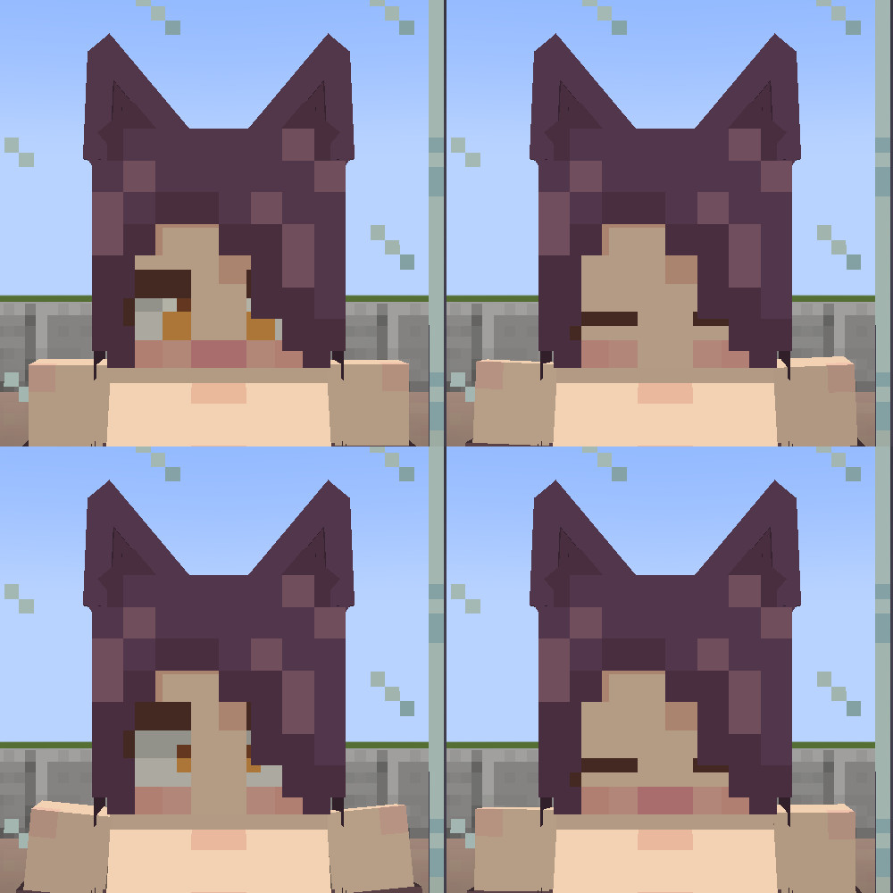
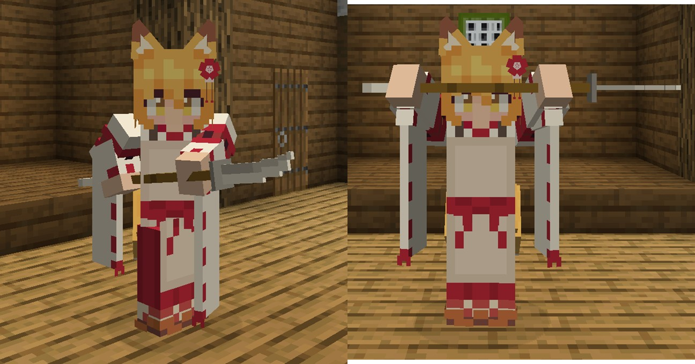
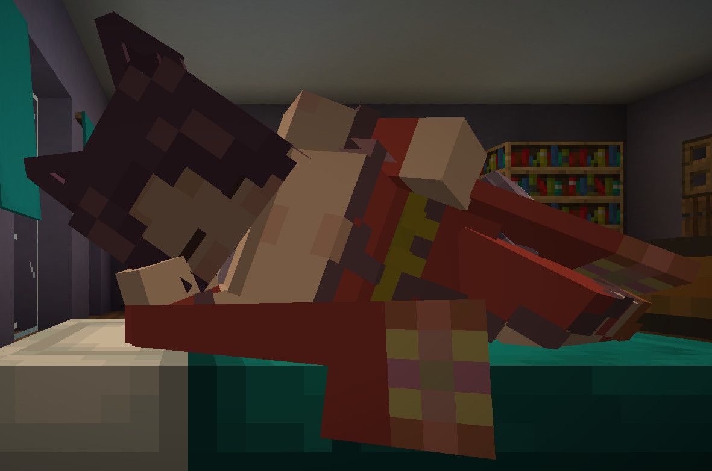
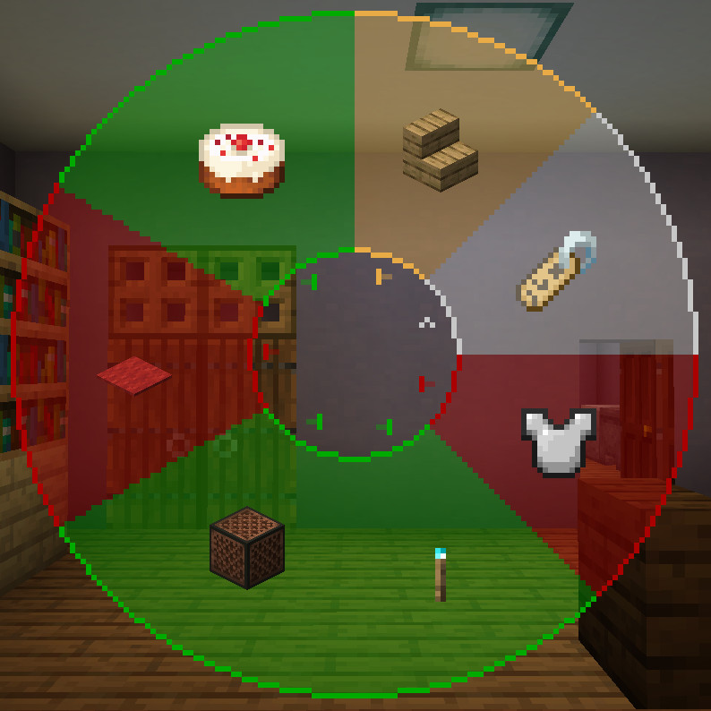

# ごあんない

ここは、**夜空**の配布ページです。

**仙狐さん**の配布ページは[こちら](https://github.com/Gakuto1112/SenkoSan)

**シロ**の配布ページは[こちら](https://github.com/Gakuto1112/SenkoSan/tree/Shiro)

**鈴**の配布ページは[こちら](https://github.com/Gakuto1112/SenkoSan/tree/Suzu)

# Sora（夜空）
TVアニメ「世話やきキツネの仙狐さん」とその原作に登場するキャラクターを再現した、MinecraftのスキンMod「[Figura](https://modrinth.com/mod/figura)」向けスキン「Sora（夜空）」です。

ターゲットFiguraバージョン：[0.1.1](https://modrinth.com/mod/figura/version/0.1.1+1.20.1-0f8b7a9)

<!--  -->

\[メイン画像準備中...\]

## 特徴
- 耳と尻尾のモデルが生えています。
  - 尻尾はプレイヤーの動きに合わせて揺れます。

    

  - 耳は**Xキー**、尻尾は**Zキー**で動かすことができます。

    

    

- 現在のHPや満腹度に応じてキャラクターの耳が垂れさがったり、表情が変わったりします。

  

- 時々瞬きします。

- [アクションホイール](#アクションホイール)で座ることができます。

  

- カーソルキー（↑→↓←）を押すと、表情が変わります。

  

- 剣が薙刀になります（原作漫画第七十七尾）。
  - メインハンドで持つと薙刀を構えます（オフハンドでは構えません）。
  - 薙刀を構えながら盾で防御をすると、薙刀で防御する構えをとります。

  

- 就寝時は特別な寝姿になります。
  

- あなたの表示名をキャラクターの名前に変更できます。
  - 他のプレイヤーがこの名前を見えるようにするには、**他のプレイヤーもFiguraを導入し、他のプレイヤー側であなたに対する信頼設定を十分上げる必要があります**。

  

- 雨が降っていると傘をさします。
  - 傘をさしている場合は雨で濡れることはありません。
  - オフハンドにアイテムを持っている時やアニメーションを再生した時は雨でも傘をしまいます（この場合はもちろん濡れます）。
  - 傘を開閉する音は[設定](#アクションホイール33アバター設定)でオフにできます。

  

- 暗視が付与されていると周囲に狐火が出現します。
  - キャラクターによって出現する狐火の数は異なります。
  - 濡れている場合は消えてしまいます。
  - シェーダーパックを適用するとブルーム効果により、より狐火らしくなります。

  

## アクションホイール
Figuraには、アクションホイールキー（デフォルトは「B」キー）を押すことで、エモートなどを実行できるリングメニューが実装されています。このアバターにもいくつかのアクションが用意されています。

### アクション1. お座り
その場に座ります。もう一度アクション実行で立ち上がります。座っている時に動いたり、ジャンプしたり、スニークしたりすると自動で立ち上がります。

### アクション2. 名前変更
プレイヤーの表示名を変更します。スクロールで表示名を選択し、アクションホイールを閉じると確定します。選択中に左クリックをすると現在の設定値に、右クリックすると初期値にリセットされます。ただし、他のプレイヤーが変更された名前を見るには、**そのプレイヤーもFiguraを導入し、他のプレイヤー側であなたに対する信頼設定を十分上げる必要があります**。

設定できる名前の選択肢は以下の通りです。

- <プレイヤー名>
- Sora
- 夜空

### アクション3. 防具の表示の切り替え
防具を表示するかどうかを設定できます。この設定はバニラの防具にのみ対応しています。

### アクション4. 一人称視点での狐火の表示の切り替え
一人称視点で狐火を表示するかどうかを設定できます。上を向いた際などに、頭上の狐火が煩わしいと感じる場合はオフにして下さい。

### アクション5. 傘の開閉音の切り替え
傘の開閉音を再生するかどうかを設定できます。傘の開閉音が煩わしいと感じる場合はオフにして下さい。

### アクション6. 常に傘をさす
傘を差せる状況下において、雨が降っていなくても常に傘をさします。撮影用途などにどうぞ。

### アクション7. メッセージの表示
アクションホイールでのメッセージ以外の、良く表示されるであろう一部メッセージを表示するかどうかを設定できます。メッセージが煩わしいと感じる場合はオフにして下さい。

## 使用方法
1. マインクラフトに[Fabric](https://fabricmc.net/)をインストールし、[Fabric API](https://www.curseforge.com/minecraft/mc-mods/fabric-api)と[Figura 0.1.1](https://modrinth.com/mod/figura/version/0.1.1+1.20.1-0f8b7a9)を追加します。各Modの依存関係にご注意ください。
2. ページ上部の緑色のボタン「**Code**」から「**Download ZIP**」からこのレポジトリのファイルをダウンロードします。（または、このレポジトリをクローンします。）
3. 圧縮ファイルの場合は展開します。
4. ``<マインクラフトのゲームフォルダ>/figura/avatars/``にアバターのデータを配置します。
   - フォルダはFiguraを追加したマインクラフトを一度起動すると自動的に生成されます。ない場合は手動で作成しても構いません。
5. ゲームメニューからFiguraメニュー（Δマーク）を開き、画面左のアバターリストから「夜空」を選択します。
6. 必要に応じて[権限設定](#推奨設定)をして下さい。
7. アバターをサーバーにアップロードすると、他のFiguraプレイヤーもあなたのアバターを見ることができます。