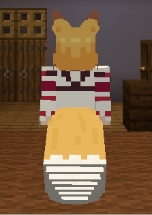

# ごあんない

ここは、**夜空**の配布ページです。

**仙狐さん**の配布ページは[こちら](https://github.com/Gakuto1112/SenkoSan)

**シロ**の配布ページは[こちら](https://github.com/Gakuto1112/SenkoSan/tree/Shiro)

**鈴**の配布ページは[こちら](https://github.com/Gakuto1112/SenkoSan/tree/Suzu)

# Sora（夜空）
TVアニメ「世話やきキツネの仙狐さん」とその原作に登場するキャラクターを再現した、MinecraftのスキンMod「[Figura](https://modrinth.com/mod/figura)」向けスキン「Sora（夜空）」です。

ターゲットFiguraバージョン：[0.1.1](https://modrinth.com/mod/figura/version/0.1.1+1.20.1-0f8b7a9)

<!--  -->

\[メイン画像準備中...\]

## 特徴
- 耳と尻尾のモデルが生えています。
  - 尻尾はプレイヤーの動きに合わせて揺れます。

    

  - 耳は**Xキー**、尻尾は**Zキー**で動かすことができます。

    

    

- 現在のHPや満腹度に応じてキャラクターの耳が垂れさがったり、表情が変わったりします。

  

- 時々瞬きします。

- [アクションホイール](#アクションホイール)で座ることができます。

  

- カーソルキー（↑→↓←）を押すと、表情が変わります。

  

- 剣が薙刀になります（原作漫画第七十七尾）。
  - メインハンドで持つと薙刀を構えます（オフハンドでは構えません）。
  - 薙刀を構えながら盾で防御をすると、薙刀で防御する構えをとります。

  

- 就寝時は特別な寝姿になります。
  

- あなたの表示名をキャラクターの名前に変更できます。
  - 他のプレイヤーがこの名前を見えるようにするには、**他のプレイヤーもFiguraを導入し、他のプレイヤー側であなたに対する信頼設定を十分上げる必要があります**。

  

- 雨が降っていると傘をさします。
  - 傘をさしている場合は雨で濡れることはありません。
  - オフハンドにアイテムを持っている時やアニメーションを再生した時は雨でも傘をしまいます（この場合はもちろん濡れます）。
  - 傘を開閉する音は[設定](#アクションホイール33アバター設定)でオフにできます。

  

- 暗視が付与されていると周囲に狐火が出現します。
  - キャラクターによって出現する狐火の数は異なります。
  - 濡れている場合は消えてしまいます。
  - シェーダーパックを適用するとブルーム効果により、より狐火らしくなります。

  