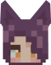

# ごあんない

ここは、**夜空**の配布ページです。

**仙狐さん**の配布ページは[こちら](https://github.com/Gakuto1112/SenkoSan)

**シロ**の配布ページは[こちら](https://github.com/Gakuto1112/SenkoSan/tree/Shiro)

**鈴**の配布ページは[こちら](https://github.com/Gakuto1112/SenkoSan/tree/Suzu)

# Sora（夜空）
TVアニメ「世話やきキツネの仙狐さん」とその原作に登場するキャラクターを再現した、MinecraftのスキンMod「[Figura](https://modrinth.com/mod/figura)」向けスキン「Sora（夜空）」です。

ターゲットFiguraバージョン：[0.1.1](https://modrinth.com/mod/figura/version/0.1.1+1.20.1-0f8b7a9)

<!--  -->

\[メイン画像準備中...\]