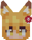
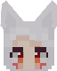
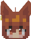

<!-- $inject(locale_link) -->

# ごあんない

ここは、**夜空**の配布ページです。

**仙狐さん**の配布ページは[こちら](https://github.com/Gakuto1112/SenkoSan)

**シロ**の配布ページは[こちら](https://github.com/Gakuto1112/SenkoSan/tree/Shiro)

**鈴**の配布ページは[こちら](https://github.com/Gakuto1112/SenkoSan/tree/Suzu)

# Sora（夜空）
TVアニメ「世話やきキツネの仙狐さん」とその原作に登場するキャラクターを再現した、MinecraftのスキンMod「[Figura](https://modrinth.com/mod/figura)」向けスキン「Sora（夜空）」です。

ターゲットFiguraバージョン：[0.1.1](https://modrinth.com/mod/figura/version/0.1.1+1.20.1-0f8b7a9)~

## レポジトリ移動のお知らせ
アバターは["SenkoSan"レポジトリ](https://github.com/Gakuto1112/SenkoSan)の"Sora"ブランチに移動しました。

[こちら](https://github.com/Gakuto1112/SenkoSan/tree/Sora)から新しい場所に移動できます。